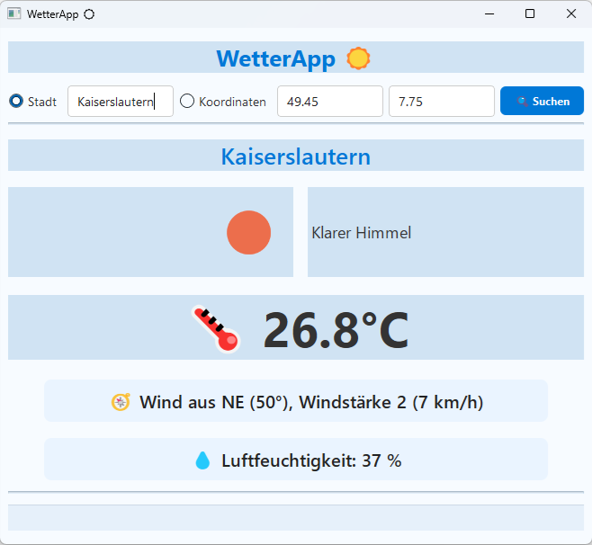

# WeatherApp – Qt/C++

A lightweight Qt/C++ desktop application that retrieves and displays current weather information from the OpenWeather API.

The project was developed as part of a C++/Qt course and prepared as a small portfolio project. It demonstrates basic GUI programming with Qt Widgets, asynchronous network requests, JSON parsing, local configuration handling, and simple error handling.

---
## Screenshot



## Features

### Two Search Modes

The application supports two input modes:

- Search by city name
- Search by geographical coordinates

The input fields are enabled or disabled depending on the selected mode.

### Live Weather Data

Weather data is requested via `QNetworkAccessManager` and displayed in the GUI.

The application shows:

- temperature
- humidity
- wind speed
- wind direction
- weather description
- city name
- coordinates returned by the API
- weather icon

### Persistent Local Settings

The application stores local settings using Qt's `QSettings` with `IniFormat`.

Stored settings include the OpenWeather API key, the last selected search mode, the last entered city name, and the last used coordinates.

The actual local configuration is described in the [Configuration](#configuration) section.

### Error Handling

The application handles and displays errors such as:

- missing API key
- invalid API key
- HTTP errors
- network errors
- API-level errors from the OpenWeather response

---

## Requirements

- Qt 6.x
- C++17 or later
- CMake
- OpenWeather API key

Tested with:

- Qt 6.9.3
- MinGW 64-bit
- Windows 11

---

## Configuration

The application creates a local `config.ini` file next to the executable on first launch. The file is ignored by Git and should not be committed.

A `config.example.ini` file is included to document the expected structure:

```ini
[OpenWeather]
apiKey=YOUR_API_KEY_HERE

[Search]
inputMode=city
```

You can obtain an API key from:

[https://openweathermap.org/api](https://openweathermap.org/api)

---

## API Endpoints Used

Weather data:

```text
https://api.openweathermap.org/data/2.5/weather
```

Weather icons:

```text
https://openweathermap.org/img/wn/<icon>@2x.png
```

Requests are handled asynchronously using `QNetworkAccessManager`.

---

## Project Structure

```text
.
├── images/
│   └── app_screenshot.png
├── CMakeLists.txt
├── main.cpp
├── mainwindow.cpp
├── mainwindow.h
├── mainwindow.ui
├── config.example.ini
├── .gitignore
└── README.md
```

---

## Code Overview

Important parts of the application:

* `getWeatherByCity()` — Builds and sends a weather request using a city name.

* `getWeatherByGeoCoords()` — Builds and sends a weather request using latitude and longitude.

* `processWeatherApiCall()` — Parses the JSON weather response and updates the UI.

* `processIconApiCall()` — Loads and displays the weather icon.

* `updateInputFields()` — Enables or disables input fields depending on the selected search mode.

* `configFilePath()` — Defines the path of the local `config.ini` file.

* `initializeConfigFile()` — Creates a default `config.ini` file on first launch.

* `loadApiKey()` — Reads the OpenWeather API key from `config.ini`.

Helper functions:

* `wDirectionToString()` — Converts wind degrees to compass directions.
* `wSpeedToBeaufort()` — Converts wind speed to the Beaufort scale.

---

## Debugging

For debugging purposes, the most recent API response is saved to:

```text
Documents/WetterApp_reply.json
```

This makes it easier to inspect API responses and extend the application.

---

## Notes

This is a learning and portfolio project. The focus is on readable Qt/C++ code, basic GUI state handling, asynchronous API access, and safe handling of local API credentials.